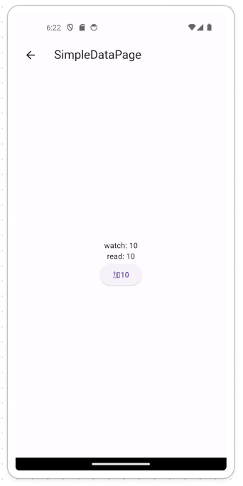
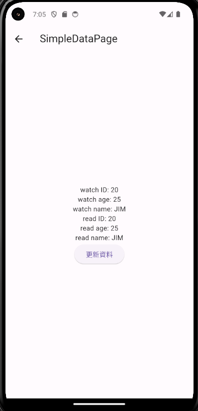
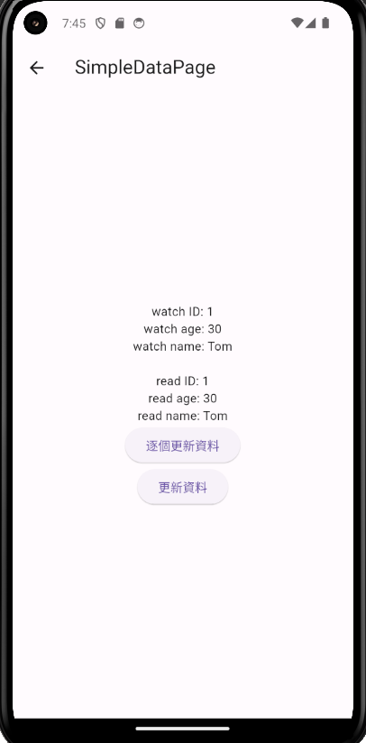
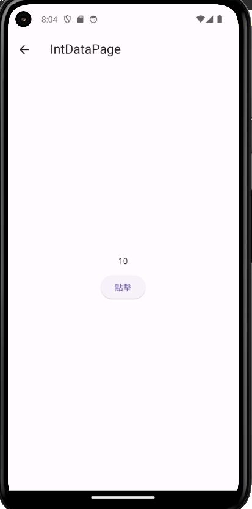
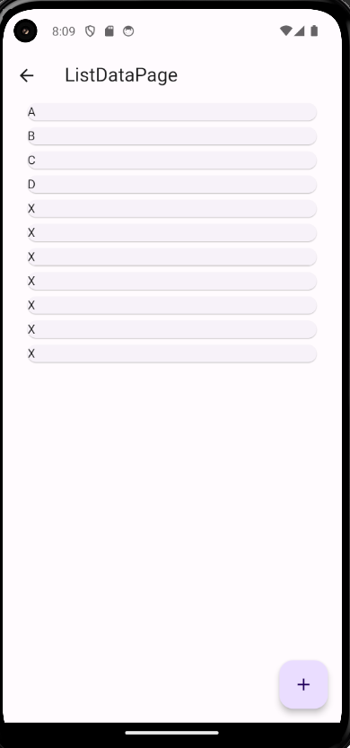
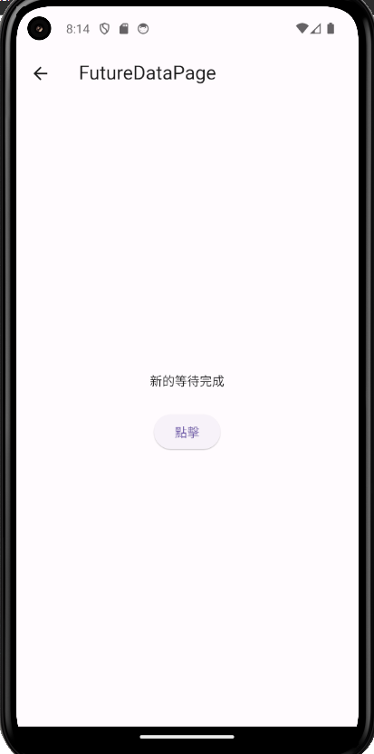
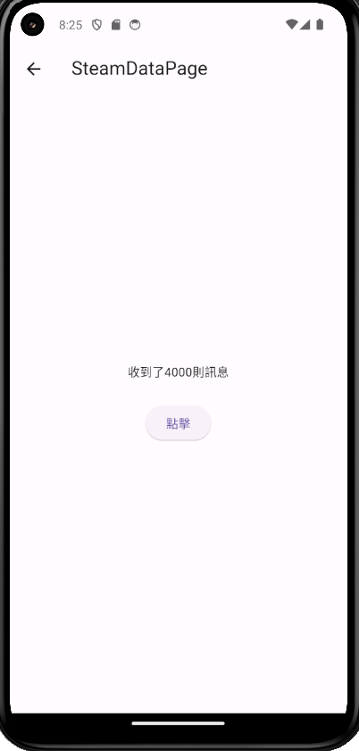

# riverpod_test_buildrunner

**2024-05-20 edit by zhJackey**

Riverpod是一個現在非常流行的狀態管理存取工具，對於開發Flutter狀態管理會是非常重要的課題

## :mag_right: 介紹

### :point_right: 簡單舉個例子：假如我想要把主頁的資料傳遞給三個Route後的Page3，那在途中會經歷page1、page2、page3。

#### :hammer: 不使用RiverPod
* 那正常來說不使用任何狀態存取工具的話的寫法會是在主頁進行數值的傳遞經過push的方式把值一個一個往後推，這樣才能確保在同一Context進行同一個數值的傳遞。
```dart
//page 1

...
int count = 10;
...
ElevatedButton(
    onPressed:()=> Nagator.push(context,MaterialPageRoute(
                  builder: (context) => const Page2(count: count),
        ),
    ),
),

//page2
class Page2 extends StatefulWidget{
    final count;
    const Page2({
        super.key,
        required this.count;
    });
    ...
}

...
ElevatedButton(
    onPressed:()=> Nagator.push(context,MaterialPageRoute(
                  builder: (context) => const Page3(count: widget.count),
        ),
    ),
),

//page3
class Page3 extends StatefulWidget{
    final count;
    const Page3({
        super.key,
        required this.count;
    });
    ...
}

@override
Widget build(BuildContext context){
    return Text(widget.count.toString());
} 
```
### :hammer: 使用Riverpod
* 只要在一開始將數據模組建立完成之後，在之後只需要簡單使用這個數據組就可以全域使用了

```dart
//count_model
class NumberNotifierProvider extends StateNotifier<>{
    NumberNotifier():super(0); //初始值
    
    void updateNumber(int newNumber){
        state = newNumber;
    }
}

final countModelData = StateNotifierProvider<NumberNotifierProvider,int>((ref){
    return NumberNotifierProvider();
});

//page1
class Page1 extends ConsumerWidget{
    ...
    int count = 10;
    ...

    @override
    Widget build(BuildContext context, WidgetRef ref){
        final NumberProvider = ref.watch(countModelData); //隨時監聽數值、動態更新

        return Scaffold(
            appBar: ...,
            body: Center(
                child: Column(
                    children:[
                        Text(NumberProvider.toString()),
                        ElevatedButton(onPressed: (){
                            ref.read(countModelData.notifier).updateNumber(count); //更新數值
                        },
                        child: Text("to_10"),
                        ),
                    ]
                )
            )
        )
} 
}

//page3
class Page3 extends ConsumerWidget{
    ...
}

@override
Widget build(BuildContext context,WidgetRef ref){
    final numberDataProvider = ref.watch(countModelData);
    return Text(numberDataProvider.toString());
} 
```
### :mag_right: Riverpod與Provider的差異

#### :bulb: Q:明明就有一個Provider為什麼還要改成Riverpod呢?
既然會有這個問題那就應該先了解一下這兩者的差異。

根據我目前所知道的
**1. Riverpod擁有Provider的功能與優點。**
**2. Riverpod在建立時能夠安全地創建、觀察、結束狀態，不怕在Widget重建時消失(setState())**
**3. 具有眾多的方法組合**
**4. 可以方便的進行測試**
**5. 可以更好的進行維護與可讀性**

###  :mag_right: Riverpod的特色

1. :bulb: 可以配合**build_runner**直接建立所需的相關內容。
2. :bulb: 具有很多強大的功能。

### :mag_right: 簡易使用規定

```dart
class MyApp extends ConsumerWidget {
  const MyApp({super.key});

  @override
  Widget build(BuildContext context, WidgetRef ref) {
    return Container();
  }
}
//--------------------------//
class MyApp extends ConsumerStatefulWidget {
  const MyApp({super.key});

  @override
  ConsumerState<ConsumerStatefulWidget> createState() => _MyAppState();
}

class _MyAppState extends ConsumerState<MyApp> {

  @override
  Widget build(BuildContext context) {
    return Container();
  }
}
```
從上面的Code可以得知：

1. Riverpod會帶入一個新的需要使用的Widget
**ConsumerWidget**

2. 對應以往的**StatelessWidget**、**StatefulWidget**，分別改成為**ConsumerWidget**、**ConsumerStatefulWidget**。

3. 在build的地方靜態Widget多了一個**WidgetRef ref**，這是一個Riverpod提供**類似Buildcontext的狀態**，用於**監聽Provider狀態**，因為 WidgetRef 是屬於一種**State類的可以改變畫面的狀態**，因此在**動態Widget也就是ConsumerStatefulWidget因為已經有State狀態**因此在這邊則不用在一次的傳遞WidgetRef ref。

---
```dart
class NumberNotifier extends StateNotifier<int>{
  NumberNotifier():super(0); //初始化變數

  void updateNumber(int newNumber){
    state = newNumber;
  }
}

// 定義 StateNotifierProvider
final numberNotifierProvider = StateNotifierProvider<NumberNotifier, int>((ref) {
  return NumberNotifier();
});

//UI部分
void main() => runApp(
      const ProviderScope(
        child: MyApp(),
      ),
    );

class MyApp extends StatelessWidget {
  const MyApp({super.key});

  @override
  Widget build(BuildContext context) {
    return const MaterialApp(
      debugShowCheckedModeBanner: false,
      title: 'Material App',
      home: HomeRoutePage(),
    );
  }
}

class HomeRoutePage extends ConsumerWidget {
  const HomeRoutePage({super.key});

  @override
  Widget build(BuildContext context, WidgetRef ref) {
    final numberDataProvider = ref.watch(numberNotifierProvider);

    return Scaffold(
      appBar: AppBar(
        title: const Text('DemoPage'),
      ),
      body: Center(
        child: Column(
          children: [
            Text("$numberDataProvider"),
            Text(ref.read(numberNotifierProvider).toString()),
            ElevatedButton(
              onPressed: () =>
                  ref.read(numberNotifierProvider.notifier).updateNumber(10),
              child: const Text('to_10'),
            ),
          ],
        ),
      ),
    );
  }
}
```
從以上的Code可以得知幾件事
1. 要啟動Riverpod需要在 **最外層也就是runApp()** 以外套上 **ProviderScope()** 才可以使用Riverpod。
2. 需要建立一個可以溝通的StateNotifierProvider狀態(當然不只有這個Provider)並且可以return數據組。
3. StateNotifierProvider、StateNotifier為Riverpod最主要特殊的類，dart原生的為ChangeNotifierProvider、ChangeNotifier，因此做為溝通此數據組的變數為**state**
4. 在UI的部分要啟用他需要建立 **ref.read()、ref.watch()** 功能已啟用。
5. watch為動態監聽變數，只要變數有進行變動，則可以隨時進行更新。
6. read為靜態監聽，更多的效果會是在附上notifier進行值的更動。
7. 在ref.read(xxx.notifier)的意思就是 **我即將改變這個provider裏頭的值了** 因此想要進行值的更動請附上notifier。

### :mag_right: 簡易範例
接下來就依照剛剛提到的特色提出一些我認為會用到的情境。
以下為會示範的種類：
1. **一般的建立-單一數據模型**
2. **搭配build_runner建立單一數據模型**
3. **多種變數數據模型**
4. **搭配build_runner建立多種變數數據模型**
5. **int形式 + build_runner 模型**
6. **List形式 + build_runner 模型**
7. **Future形式 + build_runner 模型**
8. **Steam形式 + build_runner 模型**

#### :package: 1. 單一數據模型
simple_Data_Provider.dart
simple_Data_Page.dart

```dart
//simple_Data_Provider.dart
import 'package:flutter_riverpod/flutter_riverpod.dart';

class SimpleDataProvider extends StateNotifier<int> {
  SimpleDataProvider() : super(10);

  void updateStateNumber(int value) {
    state = value;
  }
}

final simpleDataNotifierProvider =
    StateNotifierProvider<SimpleDataProvider, int>((ref) {
  return SimpleDataProvider();
});
//simple_Data_Page.dart
import 'package:flutter/material.dart';
import 'package:flutter_riverpod/flutter_riverpod.dart';
import 'package:riverpod_test_buildrunner/models/simple_Data_Provider.dart';

class SimpleDataPage extends ConsumerWidget {
  const SimpleDataPage({super.key});

  @override
  Widget build(BuildContext context, WidgetRef ref) {
    final watchSimpleDataProvider = ref.watch(simpleDataNotifierProvider);
    final readSimpleDataProvider = ref.read(simpleDataNotifierProvider);

    return Scaffold(
      appBar: AppBar(
        title: const Text('SimpleDataPage'),
      ),
      body: Center(
        child: Column(
          mainAxisAlignment: MainAxisAlignment.center,
          children: [
            Text(
              "watch: $watchSimpleDataProvider",
            ),
            Text(
              "read: $readSimpleDataProvider",
            ),
            ElevatedButton(
              onPressed: () {
                ref
                    .read(simpleDataNotifierProvider.notifier)
                    .updateStateNumber(readSimpleDataProvider + 10);
              },
              child: const Text(
                "加10",
              ),
            ),
          ],
        ),
      ),
    );
  }
}
```


#### :package: 2. 搭配build_runner建立單一數據模型
simple_Data_Provider_buildRunner.dart
simple_Data_Provider_buildRunner.g.dart
simple_Data_BuildRunner_Page.dart

>* build_runner指令 => **flutter pub run build_runner build --delete-conflicting-outputs**
>建立出來的檔案之後你也可以在其他檔案中使用SimpleDataBuildRunner裏頭的東西了

```dart
//simple_Data_Provider_buildRunner.dart
import 'package:riverpod_annotation/riverpod_annotation.dart';

part 'simple_Data_Provider_buildRunner.g.dart';

@riverpod
class SimpleDataBuildRunner extends _$SimpleDataBuildRunner{
  @override
  int build(){
    return 10;
  }

  void updateState(int value){
    state = value;
  }
}

//simple_Data_BuildRunner_Page.dart
import 'package:flutter/material.dart';
import 'package:flutter_riverpod/flutter_riverpod.dart';
import 'package:riverpod_test_buildrunner/models/simple_Data_Provider_buildRunner.dart';

class SimpleDataBuildRunnerPage extends ConsumerWidget {
  const SimpleDataBuildRunnerPage({super.key});

  @override
  Widget build(BuildContext context, WidgetRef ref) {
    final watchSimpleDataProvider = ref.watch(simpleDataBuildRunnerProvider);
    final readSimpleDataProvider = ref.read(simpleDataBuildRunnerProvider);

    return Scaffold(
      appBar: AppBar(
        title: const Text('SimpleDataPage'),
      ),
      body: Center(
        child: Column(
          mainAxisAlignment: MainAxisAlignment.center,
          children: [
            Text(
              "watch: $watchSimpleDataProvider",
            ),
            Text(
              "read: $readSimpleDataProvider",
            ),
            ElevatedButton(
              onPressed: () {
                ref
                    .read(simpleDataBuildRunnerProvider.notifier)
                    .updateState(readSimpleDataProvider + 10);
              },
              child: const Text(
                "加10",
              ),
            ),
          ],
        ),
      ),
    );
  }
}
```


#### :package: 3. 多種變數數據模型
multiple_Data_Provider.dart
multiple_Data_Page.dart

```dart
//multiple_Data_Provider.dart
import 'package:flutter_riverpod/flutter_riverpod.dart';

class UserState {
  final int ID;
  final int age;
  final String name;

  UserState({
    required this.ID,
    required this.age,
    required this.name,
  });

  UserState copyWith({int? ID, int? age, String? name}) {
    return UserState(
      ID: ID ?? this.ID,
      age: age ?? this.age,
      name: name ?? this.name,
    );
  }
}

class UserNotifier extends StateNotifier<UserState> {
  UserNotifier() : super(UserState(ID: 10, age: 18, name: "Jack"));

  void updateID(int value) {
    state = state.copyWith(ID: value);
  }

  void updateAge(int value) {
    state = state.copyWith(age: value);
  }

  void updateName(String value) {
    state = state.copyWith(name: value);
  }
}

final userNotifierProvider =
    StateNotifierProvider<UserNotifier, UserState>((ref) {
  return UserNotifier();
});

//multiple_Data_Page.dart
import 'package:flutter/material.dart';
import 'package:flutter_riverpod/flutter_riverpod.dart';
import 'package:riverpod_test_buildrunner/models/multiple_Data_Provider.dart';

class MultipleDataPage extends ConsumerWidget {
  const MultipleDataPage({super.key});

  @override
  Widget build(BuildContext context, WidgetRef ref) {
    final watchMultipleDataProvider = ref.watch(userNotifierProvider);
    final readMultipleDataProvider = ref.read(userNotifierProvider);

    return Scaffold(
      appBar: AppBar(
        title: const Text('SimpleDataPage'),
      ),
      body: Center(
        child: Column(
          mainAxisAlignment: MainAxisAlignment.center,
          children: [
            Text(
              "watch ID: ${watchMultipleDataProvider.ID}",
            ),
            Text(
              "watch age: ${watchMultipleDataProvider.age}",
            ),
            Text(
              "watch name: ${watchMultipleDataProvider.name}",
            ),
            Text(
              "read ID: ${readMultipleDataProvider.ID}",
            ),
            Text(
              "read age: ${readMultipleDataProvider.age}",
            ),
            Text(
              "read name: ${readMultipleDataProvider.name}",
            ),
            ElevatedButton(
              onPressed: () {
                ref.read(userNotifierProvider.notifier).updateID(20);
                ref.read(userNotifierProvider.notifier).updateAge(25);
                ref.read(userNotifierProvider.notifier).updateName("JIM");
              },
              child: const Text(
                "更新資料",
              ),
            ),
          ],
        ),
      ),
    );
  }
}
```


#### :package: 4. 搭配build_runner建立多種變數數據模型
mutiple_Data_BuildRunner_Page.dart
mutiple_Data_Provider_buildRunner.g.dart
mutiple_Data_Provider_buildRunner.dart

```dart
//mutiple_Data_Provider_buildRunner
import 'package:flutter_riverpod/flutter_riverpod.dart';
import 'package:riverpod_annotation/riverpod_annotation.dart';

part 'mutiple_Data_Provider_buildRunner.g.dart';

@riverpod
class UserStateNotifier extends _$UserStateNotifier {
  @override
  UserStateBuildRunner build() {
    return UserStateBuildRunner(iD: 123, age: 15, name: "ak");
  }

  void updateID(int idValue) {
    state = state.copyWith(iD: idValue);
  }

  void updateAge(int ageValue) {
    state = state.copyWith(age: ageValue);
  }

  void updateName(String nameValue) {
    state = state.copyWith(name: nameValue);
  }

  // 添加一個方法來同時更新多個變量
  void updateAll({int? iD, int? age, String? name}) {
    state = state.copyWith(iD: iD, age: age, name: name);
  }
}

class UserStateBuildRunner {
  final int? iD;
  final int? age;
  final String? name;

  UserStateBuildRunner({
    this.iD,
    this.age,
    this.name,
  });

  UserStateBuildRunner copyWith({int? iD, int? age, String? name}) {
    return UserStateBuildRunner(
      iD: iD ?? this.iD,
      age: age ?? this.age,
      name: name ?? this.name,
    );
  }
}
//mutiple_Data_BuildRunner_Page
import 'package:flutter/material.dart';
import 'package:flutter_riverpod/flutter_riverpod.dart';
import 'package:riverpod_test_buildrunner/models/mutiple_Data_Provider_buildRunner.dart';

class MultipleDataBuildRunnerPage extends ConsumerWidget {
  const MultipleDataBuildRunnerPage({super.key});

  @override
  Widget build(BuildContext context, WidgetRef ref) {
    final watchMultipleDataProvider = ref.watch(userStateNotifierProvider);
    final readMultipleDataProvider = ref.read(userStateNotifierProvider);

    return Scaffold(
      appBar: AppBar(
        title: const Text('SimpleDataPage'),
      ),
      body: Center(
        child: Column(
          mainAxisAlignment: MainAxisAlignment.center,
          children: [
            Text(
              "watch ID: ${watchMultipleDataProvider.iD}",
            ),
            Text(
              "watch age: ${watchMultipleDataProvider.age}",
            ),
            Text(
              "watch name: ${watchMultipleDataProvider.name}",
            ),
            const SizedBox(height: 20),
            Text(
              "read ID: ${readMultipleDataProvider.iD}",
            ),
            Text(
              "read age: ${readMultipleDataProvider.age}",
            ),
            Text(
              "read name: ${readMultipleDataProvider.name}",
            ),
            ElevatedButton(
              onPressed: () {
                // 逐個更新狀態
                ref.read(userStateNotifierProvider.notifier).updateID(20);
                ref.read(userStateNotifierProvider.notifier).updateAge(25);
                ref.read(userStateNotifierProvider.notifier).updateName("JIM");
              },
              child: const Text('逐個更新資料'),
            ),
            ElevatedButton(
              onPressed: () {
                ref.read(userStateNotifierProvider.notifier).updateAll(
                      iD: 1,
                      age: 30,
                      name: 'Tom',
                    );
              },
              child: const Text(
                "更新資料",
              ),
            ),
          ],
        ),
      ),
    );
  }
}
```


#### :package: 5. int形式 + build_runner 模型
int_Data_BuildRunner_Page.dart
int_Data_BuildRunner.dart
int_Data_BuildRunner.g.dart
```dart
//int_Data_BuildRunner.dart
import 'package:riverpod_annotation/riverpod_annotation.dart';

part 'int_Data_BuildRunner.g.dart';

@riverpod
class intDataNotifier extends _$intDataNotifier {
  @override
  int build() {
    return 0;
  }

  void updateData(int value) {
    state = value;
  }
}
//int_Data_BuildRunner_Page.dart
import 'package:flutter/material.dart';
import 'package:flutter_riverpod/flutter_riverpod.dart';
import 'package:riverpod_test_buildrunner/models/int_Data_BuildRunner.dart';

class IntDataPage extends ConsumerStatefulWidget {
  const IntDataPage({super.key});

  @override
  ConsumerState<ConsumerStatefulWidget> createState() => _IntDataPageState();
}

class _IntDataPageState extends ConsumerState<IntDataPage> {
  @override
  Widget build(BuildContext context) {
    final s1 = ref.watch(intDataNotifierProvider);

    final button = ElevatedButton(
      onPressed: () {
        final notifier = ref.read(intDataNotifierProvider.notifier);

        notifier.updateData(ref.read(intDataNotifierProvider) + 10);
      },
      child: const Text('點擊'),
    );

    return Scaffold(
      appBar: AppBar(
        title: const Text("IntDataPage"),
      ),
      body: Center(
        child: Column(
          mainAxisAlignment: MainAxisAlignment.center,
          children: [
            Text('$s1'),
            const SizedBox(height: 10),
            button,
          ],
        ),
      ),
    );
  }
}

```


#### :package: 6. List形式 + build_runner 模型
List_Data_BuildRunner.dart
List_Data_BuildRunner.g.dart
List_Data_BuildRunner_Page

```dart
//List_Data_BuildRunner.dart
import 'package:riverpod_annotation/riverpod_annotation.dart';
part 'List_Data_BuildRunner.g.dart';

@riverpod
class ListDataNotifier extends _$ListDataNotifier {
  @override
  List<String> build() {
    return ['A', 'B', 'C', 'D'];
  }

  void updateState() {
    final oldState = state;
    final newState = [...oldState, 'X'];
    state = newState;
  }
}

//List_Data_BuildRunner_Page
import 'package:flutter/material.dart';
import 'package:flutter_riverpod/flutter_riverpod.dart';
import 'package:riverpod_test_buildrunner/models/List_Data_BuildRunner.dart';

class ListDataPage extends ConsumerWidget {
  const ListDataPage({super.key});

  @override
  Widget build(BuildContext context, WidgetRef ref) {
    final s2 = ref.watch(listDataNotifierProvider);

    ref.listen(listDataNotifierProvider, (previous, next) {
      final s2_List = ref.watch(listDataNotifierProvider);

      debugPrint("$s2_List");
    });

    final listView = ListView.builder(
      itemCount: s2.length,
      itemBuilder: (_, index) {
        final text = Text(s2[index]);
        return Card(child: text);
      },
    );

    final button = FloatingActionButton(
      onPressed: () {
        final notifier = ref.read(listDataNotifierProvider.notifier);
        notifier.updateState();
      },
      child: const Icon(Icons.add),
    );

    Widget baseWidgt(Widget body) {
      return Scaffold(
        appBar: AppBar(
          title: const Text('ListDataPage'),
        ),
        body: body,
        floatingActionButton: button,
      );
    }

    return baseWidgt(
      Padding(
        padding: const EdgeInsets.symmetric(horizontal: 25),
        child: listView,
      ),
    );
  }
}
```


#### :package: 7. Future形式 + build_runner 模型
future_Data_BuildRunner.dart
future_Data_BuildRunner.g.dart
future_Data_BuildRunner_Page.dart

* Riverpod提供一個強大的AsyncValue的方法可以製造等同像FutureBuilder()一樣效果的等待策略。

> 基礎語法為 監聽該provider後 使用 xx.when()
> ```dart
> final widget = s3.when(
>      loading: () => const Text('準備中..'),
>      error: (e, s) => Text('錯誤:$e,error code:$s'),
>      data: (data) => Text(data),
>    );
> ```
> loading會對應Provider你選建立的loading動作，在此為顯示文字準備中
> error必須要有(e,s)(error,statusCode)
> data就是最後等待完的資料，可以像是call API完成後的傳遞資料

```dart
//future_Data_BuildRunner.dart
import 'package:riverpod_annotation/riverpod_annotation.dart';
part 'future_Data_BuildRunner.g.dart';

@riverpod
class FutureDataNotifier extends _$FutureDataNotifier {
  @override
  Future<String> build() async {
    // 等待3秒
    const sec3 = Duration(seconds: 3);
    await Future.delayed(sec3);
    // 第一次等待完成
    return '基本的等待完成';
  }

  // build_runner可改變方法
  void updateState() async {
    // 使用AsyncValue進行Future系列的進行，await之類的
    state = const AsyncValue.loading();
    const sec3 = Duration(seconds: 3);
    await Future.delayed(sec3);
    // 更新目標state
    state = const AsyncValue.data('新的等待完成');
  }
}
//future_Data_BuildRunner_Page.dart
import 'package:flutter/material.dart';
import 'package:flutter_riverpod/flutter_riverpod.dart';
import 'package:riverpod_test_buildrunner/s3.dart';

class FutureDataPage extends ConsumerWidget {
  const FutureDataPage({super.key});

  @override
  Widget build(BuildContext context, WidgetRef ref) {
    final s3 = ref.watch(s3NotifierProvider);

    final widget = s3.when(
      loading: () => const Text('準備中..'),
      error: (e, s) => Text('錯誤:$e,error code:$s'),
      data: (data) => Text(data),
    );

    final button = ElevatedButton(
      onPressed: () {
        final notifier = ref.read(s3NotifierProvider.notifier);
        notifier.updateState();
      },
      child: const Text('點擊'),
    );

    Widget baseWidgt(Widget body) {
      return Scaffold(
        appBar: AppBar(
          title: const Text('FutureDataPage'),
        ),
        body: body,
      );
    }

    return baseWidgt(
      Center(
        child: Column(
          mainAxisAlignment: MainAxisAlignment.center,
          children: [
            widget,
            const SizedBox(height: 25),
            button,
          ],
        ),
      ),
    );
  }
}
```


#### :package: 8. Steam形式 + build_runner 模型
steam_Data_BuilderRunner.dart
steam_Data_BuilderRunner.g.dart
steam_Data_BuildRunner_page.dart
```dart
//steam_Data_BuilderRunner.dart
import 'dart:async';
import 'package:riverpod_annotation/riverpod_annotation.dart';
part 'steam_Data_BuilderRunner.g.dart';

@riverpod
class SteamDataNotifier extends _$SteamDataNotifier {
  @override
  Stream<String> build() {
    // 每秒傳遞訊息 stream
    final controller = StreamController<String>();
    const sec1 = Duration(milliseconds: 1);
    final timer = Timer.periodic(sec1, (t) {
      controller.add('收到了${t.tick}則訊息');
    });
    // 等待4秒鐘
    const sec4 = Duration(seconds: 4);
    Future.delayed(sec4, () {
      timer.cancel();
      controller.sink.close();
    });
    return controller.stream;
  }

  // 重新開啟Steam
  void updateState() async {
    // 等待一秒
    const sec1 = Duration(seconds: 1);
    await Future.delayed(sec1);
    // 等完一秒後直接給資料
    state = const AsyncValue.data('收到了55則訊息');
    // 等待一秒
    await Future.delayed(sec1);
    // 等完一秒後直接給資料
    state = const AsyncValue.data('收到了99則訊息');
  }
}

//steam_Data_BuildRunner_page.dart
import 'package:flutter/material.dart';
import 'package:flutter_riverpod/flutter_riverpod.dart';
import 'package:riverpod_test_buildrunner/s4.dart';

class SteamDataPage extends ConsumerWidget {
  const SteamDataPage({super.key});

  @override
  Widget build(BuildContext context, WidgetRef ref) {
    final s4 = ref.watch(steamDataNotifierProvider);

    final widget = s4.when(
      loading: () => const Text('準備中..'),
      error: (e, s) => Text('錯誤:$e,error code:$s'),
      data: (data) => Text(data),
    );

    final button = ElevatedButton(
      onPressed: () {
        final notifier = ref.read(steamDataNotifierProvider.notifier);
        notifier.updateState();
      },
      child: const Text('點擊'),
    );

    Widget baseWidgt(Widget body) {
      return Scaffold(
        appBar: AppBar(
          title: const Text('SteamDataPage'),
        ),
        body: body,
      );
    }

    return baseWidgt(
      Center(
        child: Column(
          mainAxisAlignment: MainAxisAlignment.center,
          children: [
            widget,
            const SizedBox(height: 25),
            button,
          ],
        ),
      ),
    );
  }
}
```

